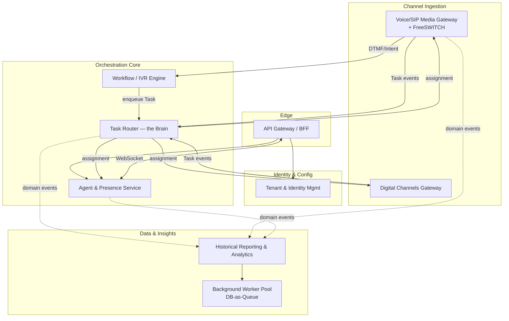
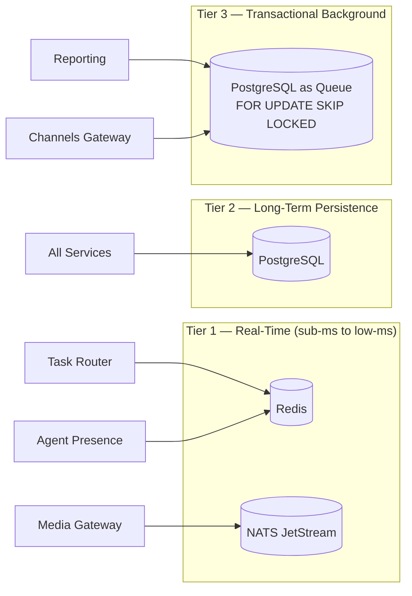
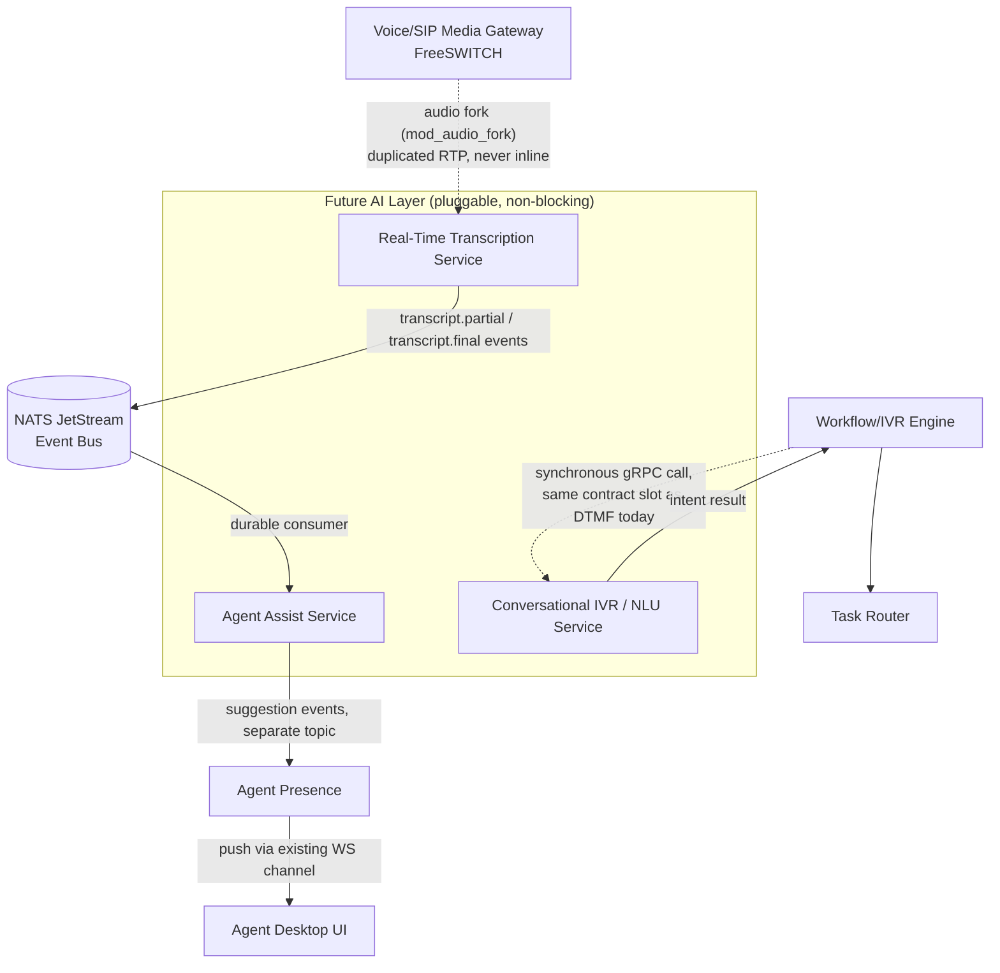

# CCaaS Enterprise Architecture Blueprint

**Document Owner:** Chief Software Architect
**Scope:** Multi-tenant, cloud-native Contact Center as a Service (CCaaS) platform
**Target Runtime:** Kubernetes (local: Docker Desktop K8s → production: any conformant cluster)
**Primary Stack:** Go (microservices), FreeSWITCH (media/SIP), PostgreSQL, Redis, NATS JetStream
**Status:** v1.0 — Foundational blueprint for scaffolding

---

## Table of Contents

1. [Architectural Principles & Foundation](#1-architectural-principles--foundation)
2. [Microservices Topology (Domain-Driven Design)](#2-microservices-topology-domain-driven-design)
3. [Data Architecture & Inter-Process Communication](#3-data-architecture--inter-process-communication)
4. [Future AI Integration Hooks](#4-future-ai-integration-hooks)
5. [Appendix: Repository & Naming Conventions](#5-appendix-repository--naming-conventions)

---

## 1. Architectural Principles & Foundation

The platform is built on four non-negotiable pillars. Every service, schema, and event contract designed later in this document must satisfy all four.

### 1.1 Multi-Tenancy

Multi-tenancy is treated as a **cross-cutting concern enforced at three layers**, not a feature bolted onto individual services.

#### Layer 1 — API / Edge Enforcement
- Every external request terminates at an **API Gateway / BFF** that resolves a `tenant_id` from the authenticated principal (JWT claim `tid`) — **never** from a client-supplied header or body field. A client-supplied tenant ID is treated as untrusted input and is only used for cross-checking (reject on mismatch), never for authorization.
- The Gateway injects `tenant_id` as a **gRPC metadata field** (`x-tenant-id`) on every downstream call. Internal services are written to distrust this too — see Layer 2.
- Rate limiting, quota enforcement, and feature-flagging (e.g., "Tenant X has AI Agent Assist enabled") happen at this layer so noisy or over-quota tenants cannot degrade others (the "noisy neighbor" problem).

#### Layer 2 — Service-Level Enforcement
- Every internal service **re-validates** `tenant_id` against the resource being accessed before acting — it does not trust the gateway blindly (defense in depth). A gRPC interceptor/middleware pattern is used so this is applied uniformly rather than re-implemented per handler.
- No service method may accept a request that implicitly operates "across all tenants" unless it is an explicitly marked internal/admin RPC, separately authenticated via mTLS + a distinct admin scope.

#### Layer 3 — Database-Level Enforcement
Two patterns are available; the blueprint standardizes on **Pattern A** for all OLTP services, with **Pattern B** reserved for tenants requiring contractual data isolation (e.g., regulated enterprise customers):

| Pattern | Mechanism | Use Case |
|---|---|---|
| **A. Shared Schema + Row-Level Security (Default)** | Every tenant-scoped table carries a `tenant_id UUID NOT NULL` column. PostgreSQL **Row-Level Security (RLS)** policies are enabled on the table, and the application sets `SET app.current_tenant = '<tenant_id>'` per connection/transaction. RLS policies filter every query transparently — even a buggy `SELECT *` cannot leak cross-tenant rows. | Default for 95% of tenants. Efficient pooling, single schema to migrate. |
| **B. Schema-per-Tenant (Isolated)** | Dedicated Postgres schema (or database) per tenant, selected via a tenant→connection-string lookup at the data-access layer. | Reserved for compliance-sensitive enterprise tenants. Higher operational overhead (migrations must fan out). |

**Implementation rule:** Data-access code in Go is generated/wrapped so that **no repository method compiles without a `tenant_id` parameter or an already-scoped `*sql.Tx`**. This makes "forgot to filter by tenant" a compile-time-visible smell during code review, and RLS is the last line of defense if it's missed.

### 1.2 Event-Driven Architecture (EDA)

The system is built around a **central event backbone** (NATS JetStream — see Section 3) rather than direct service-to-service chaining for anything that isn't a synchronous request/response need.

- **Command vs. Event separation:** Synchronous, "I need an answer now" calls (e.g., Task Router asking Agent Presence "who is available?") use gRPC. Everything that is a *fact that happened* (`TaskCreated`, `AgentStatusChanged`, `CallEnded`) is published as an **immutable event** to the bus.
- **Tenant-scoped subjects:** Every event subject is namespaced as `tenant.{tenant_id}.{domain}.{event_type}` (e.g., `tenant.acme-corp.voice.call.ended`). This allows per-tenant consumer filtering, per-tenant observability, and — critically — lets future AI consumers subscribe only to the tenants that have opted into a given AI feature.
- **Durability by default:** Domain events that matter for reporting, billing, or AI consumption are published to **JetStream streams** (durable, replayable), not fire-and-forget core NATS subjects. This means a new consumer (like a future Agent Assist service) can attach later and still process the last N hours/days of events without any change to the producer.

### 1.3 Future AI Readiness

This is the principle that most heavily influences topology decisions in Section 2 and 4, so it is stated explicitly here:

> **No core service (Task Router, Media Gateway, Workflow Engine) should ever have a hard dependency, import, or blocking call into an AI service.** AI services are always *consumers* of events/media the core already produces, never *upstream blockers* of the core path.

This is achieved by two structural guarantees baked in from day one, even before any AI service exists:
1. **Event streams are durable and replayable (JetStream)** — an AI consumer added in month 8 can subscribe to `tenant.*.voice.*` and immediately have historical context without backfill scripts.
2. **Media is tapped, not intercepted** — the Voice/SIP Media Gateway is designed with a **fork point** (FreeSWITCH `mod_audio_fork` / `mod_shout`-style pattern) so raw audio can be duplicated to a streaming consumer without sitting inline in the RTP path. If the AI consumer is slow or down, **the call is completely unaffected**.

### 1.4 Kubernetes Approach for the Windows Home Lab

**Recommendation: Docker Desktop Kubernetes (confirmed choice).**

| Concern | Recommendation | Rationale |
|---|---|---|
| **Cluster** | Docker Desktop's built-in K8s (Settings → Kubernetes → Enable) | Single-node, tightly integrated with Windows' Docker engine, no separate VM/hypervisor juggling like Minikube's driver model requires. Good enough for a single-tenant dev topology of ~15-20 services. |
| **Ingress** | `ingress-nginx` via Helm, exposed on `localhost` through Docker Desktop's automatic port mapping | Docker Desktop forwards `LoadBalancer`-type services to `localhost` directly — no need for `minikube tunnel` or MetalLB. Use path-based routing (`/api/*`, `/ws/*`) to simulate the eventual production API Gateway boundary early. |
| **TLS locally** | `mkcert` for a locally-trusted CA + wildcard cert for `*.ccaas.local` (added to Windows `hosts` file) | Lets you test WebSocket/WSS (Agent Desktop) and secure gRPC-Web flows exactly as they'll run in prod. |
| **Persistent Volumes** | Docker Desktop's default `hostpath` StorageClass (`docker-desktop`) | Sufficient for Postgres/Redis/NATS JetStream file-store dev data. **Explicitly document that this is not multi-node-safe** — production must use a real CSI driver (e.g., cloud block storage or Longhorn/Rook for on-prem clusters). |
| **Local image registry** | Build directly into Docker Desktop's local Docker daemon (`eval` not needed, unlike Minikube) and reference images with `imagePullPolicy: IfNotPresent` | Avoids a redundant local registry container for a single-node dev loop. |
| **Secrets** | Kubernetes `Secret` objects seeded via `kubectl create secret` from a local (git-ignored) `.env.local`, later swapped for a real secrets manager (Vault / cloud KMS) via the same interface | Keeps the app code identical between dev and prod — only the secret *source* changes. |
| **Namespacing** | One namespace per environment (`ccaas-dev`), **not** per tenant | Tenant isolation is a data-plane concern (Section 1.1), not a Kubernetes-namespace concern — namespace-per-tenant does not scale operationally past a handful of tenants and isn't how this design isolates data anyway. |

---

## 2. Microservices Topology (Domain-Driven Design)

Each bounded context below maps to one deployable Go service (or, for the Media Gateway, one service + one specialized media process it manages). "Stateful" below means the service holds state that cannot be trivially recreated by restarting the pod (in-memory session state, active media streams) — **all services are still designed to run as multiple replicas**; "stateful" ones simply require sticky routing or external state coordination to do so safely.

### 2.1 Service Map (Overview)



### 2.2 Service Responsibility Matrix

| Service | Primary Responsibility | State | Key Dependencies |
|---|---|---|---|
| **Tenant & Identity Management** | CRUD for tenant configuration (routing policies, business hours, feature flags); user/agent identity, roles (RBAC), and OAuth2/OIDC-based authentication; issues short-lived JWTs consumed by every other service. | **Stateless** (compute) / backed by **stateful** Postgres | PostgreSQL (system-of-record), Redis (JWT/session cache), no dependency on any other domain service — this is intentionally the most upstream service. |
| **Voice/SIP Media Gateway** | Terminates SIP trunks and WebRTC (browser softphone) sessions; manages media negotiation and RTP via **FreeSWITCH**; converts call setup into a generic `Task` (voice modality) published to the bus; executes agent-side call control commands (hold, transfer, mute) issued by the Task Router / Agent Desktop. | **Stateful** (active call = live RTP session + FreeSWITCH channel state) | FreeSWITCH (mod_sofia for SIP, mod_verto/mod_rtc for WebRTC), NATS (event publish), gRPC to Workflow Engine (for IVR-time queries), Redis (ephemeral call-leg → tenant/task mapping). |
| **Digital Channels Gateway** | Normalizes inbound Chat, SMS, Email, and Social messages into the same generic `Task` abstraction the voice path produces, so the Task Router never needs to know the origin channel. Handles outbound message delivery (agent replies) back to the originating channel provider. | **Stateless** | Channel provider webhooks/SDKs (Twilio, SMTP relay, social APIs), NATS (publish/subscribe), PostgreSQL (message/thread persistence via async workers, not inline). |
| **Task Router** *(Brain — external spec)* | Owns the routing algorithm: matches queued `Task`s to available agents based on skills, priority, tenant routing policy, and real-time presence. Treated in this document as a black box with a well-defined contract: **consumes** `TaskCreated`/`TaskCancelled` events + agent availability queries; **emits** `TaskAssigned`/`TaskRequeued` events. | **Stateful** (in-memory routing queues, ideally checkpointed) | NATS (consume Task events, emit assignment events), gRPC to Agent & Presence Service (real-time availability), Redis (routing queue snapshotting for fast failover). |
| **Agent & Presence Service** | Holds the live WebSocket connection to every logged-in Agent Desktop; is the single source of truth for real-time agent status (Available, On Call, Wrap-Up, Offline); pushes task-offer notifications and pulls accept/reject responses from agents. | **Stateful** (live WebSocket registry) | Redis (pub/sub fan-out across replicas + presence key storage with TTL heartbeats), NATS (publish `AgentStatusChanged`), gRPC server consumed by Task Router. |
| **Workflow / IVR Engine** | Executes tenant-defined call/chat flows as a state machine: plays prompts, collects DTMF or NLU intents, queries external systems (CRM lookups, business-hours checks) *before* a Task is hard-queued to the Router. This is where a future Conversational IVR AI plugs in as a drop-in "intent" step. | **Stateless** (flow state persisted per-session in Redis so any replica can continue a flow) | Voice/SIP Media Gateway (playback/DTMF control via gRPC), Redis (flow session state), external system connectors (REST/gRPC), NATS (enqueue final Task). |
| **Historical Reporting & Analytics** | Subscribes to **all** domain events (durably, via JetStream) and materializes them into query-optimized storage for BI dashboards, SLA/QoS reporting, and compliance exports. Never sits in the real-time path of any other service. | **Stateless ingestion** / backed by **stateful** analytical store (Postgres w/ partitioned tables initially; ClickHouse as a documented future upgrade path for high-cardinality CDR analytics) | NATS JetStream (durable consumer, replay-capable), PostgreSQL/ClickHouse. |
| **Background Worker Pool** | Executes transactional, non-real-time jobs pulled from a **Database-as-a-Queue** (Section 3.3): post-call wrap-up data sync, webhook delivery to tenant systems, billing/usage-metering rollups, scheduled report generation. | **Stateless** (horizontally scaled workers; coordination via row locking, not app state) | PostgreSQL (`SELECT ... FOR UPDATE SKIP LOCKED`), downstream targets vary by job type (webhook URLs, billing DB, report storage). |
| **API Gateway / BFF** *(supporting, not a domain service)* | Single external entry point: TLS termination, JWT validation, tenant resolution, request routing to internal gRPC services, WebSocket upgrade proxying for Agent Desktop. | **Stateless** | Tenant & Identity Management (token validation), all internal services it fronts. |

---

## 3. Data Architecture & Inter-Process Communication

### 3.1 The "Right Tool for the Right Job" Data Strategy



#### Tier 1 — High-Speed Real-Time State & Pub/Sub

| Technology | What lives here | Why not Postgres |
|---|---|---|
| **Redis** | Agent presence keys (`presence:{tenant}:{agent_id}` with short TTL + heartbeat refresh), Task Router's live routing-queue snapshot, IVR flow session state, JWT/session cache. | This data is **ephemeral and access-latency-critical** (sub-millisecond reads on every routing decision). Losing it on a crash is acceptable *if* it can be rebuilt from an authoritative event log — which JetStream provides. Using Postgres here would add I/O latency the routing hot-path cannot afford. |
| **NATS JetStream** | The event backbone for all domain events (`TaskCreated`, `AgentStatusChanged`, `CallEnded`, etc.) and live voice-signaling notifications (e.g., "task offer" push to Agent Presence Service). | Purpose-built pub/sub with at-least-once delivery, consumer groups, and **replayability** — critical for the AI-readiness principle in Section 1.3. Chosen over RabbitMQ here primarily for its lighter operational footprint in a home-lab/Go-native environment and native support for durable + ephemeral subjects side by side; RabbitMQ remains a valid substitute if broader protocol support (AMQP/STOMP) becomes a requirement. |

#### Tier 2 — Long-Term Persistence

**PostgreSQL** is the system of record for anything that must survive indefinitely and be queried transactionally:
- Tenant configuration, routing policies, feature flags
- User/agent identity, roles, permissions
- Finalized Call Detail Records (CDRs) and message transcripts (post-processing)
- Audit trails (who changed what tenant config, when)
- Billing ledgers

Row-Level Security (Section 1.1) is applied at this tier for every tenant-scoped table.

#### Tier 3 — Transactional Background Processing (Database-as-a-Queue)

For jobs that are **transactional but not latency-sensitive** (a few seconds to a few minutes of delay is completely acceptable), the blueprint deliberately avoids introducing a *fourth* piece of infrastructure (e.g., a separate job-queue system) and instead uses Postgres itself as a durable, transactionally-safe queue.

**Pattern:**

```sql
-- jobs table (simplified)
CREATE TABLE background_jobs (
    id BIGSERIAL PRIMARY KEY,
    tenant_id UUID NOT NULL,
    job_type TEXT NOT NULL,          -- e.g. 'webhook_delivery', 'wrapup_sync', 'billing_rollup'
    payload JSONB NOT NULL,
    status TEXT NOT NULL DEFAULT 'pending',   -- pending | processing | done | failed
    attempts INT NOT NULL DEFAULT 0,
    run_after TIMESTAMPTZ NOT NULL DEFAULT now(),  -- enables scheduling/backoff
    created_at TIMESTAMPTZ NOT NULL DEFAULT now()
);

CREATE INDEX idx_jobs_claimable ON background_jobs (run_after)
    WHERE status = 'pending';
```

A worker claims a batch of jobs **atomically**, so N worker replicas never race on the same row:

```sql
WITH claimed AS (
    SELECT id FROM background_jobs
    WHERE status = 'pending' AND run_after <= now()
    ORDER BY run_after
    FOR UPDATE SKIP LOCKED
    LIMIT 20
)
UPDATE background_jobs
SET status = 'processing', attempts = attempts + 1
WHERE id IN (SELECT id FROM claimed)
RETURNING id, tenant_id, job_type, payload;
```

`FOR UPDATE SKIP LOCKED` guarantees that if Worker A has already locked a row, Worker B's identical query simply skips it and grabs the next available row instead of blocking — giving horizontal scalability of the worker pool with **zero external coordination**.

**Go worker loop sketch:**

```go
func (w *Worker) pollAndProcess(ctx context.Context) error {
    tx, err := w.db.BeginTx(ctx, nil)
    if err != nil {
        return err
    }
    defer tx.Rollback()

    jobs, err := claimJobs(ctx, tx, 20) // runs the SKIP LOCKED query above
    if err != nil || len(jobs) == 0 {
        return err
    }
    if err := tx.Commit(); err != nil {
        return err
    }

    for _, job := range jobs {
        go w.dispatch(job) // job_type routes to a handler: webhook, wrap-up sync, billing, report
    }
    return nil
}
```

**Canonical use cases for this tier:**
- Post-call wrap-up data synchronization to CRM/external systems
- Outbound webhook delivery to tenant-configured endpoints (with retry/backoff via `run_after`)
- Billing and usage-metering rollups (nightly or near-real-time aggregation)
- Scheduled/on-demand report generation for the Historical Reporting service

### 3.2 Inter-Process Communication Summary

| Communication Need | Mechanism | Example |
|---|---|---|
| **Synchronous internal request/response** | **gRPC** (protobuf-defined contracts, generated Go clients/servers) | Task Router → Agent & Presence Service: "give me current available agents for skill X" |
| **External client ↔ platform** | **API Gateway** (REST/JSON + WebSocket upgrade for the Agent Desktop) fronting internal gRPC services | Agent Desktop web app → Gateway → Agent & Presence Service |
| **Decoupled, fan-out, or replayable triggers** | **NATS JetStream** event bus, subjects namespaced `tenant.{tenant_id}.{domain}.{event}` | `VoiceMediaGateway` publishes `tenant.acme.voice.call.ended` → consumed independently by Task Router (queue cleanup), Historical Reporting, and (future) Transcription service |
| **Transactional, delay-tolerant work** | **PostgreSQL Database-as-a-Queue** (Section 3.3) | Wrap-up sync, webhook delivery, billing rollups |
| **Live agent-facing push** | **WebSocket** (terminated at Agent & Presence Service, proxied through the Gateway) | Task offer notification, presence updates |

---

## 4. Future AI Integration Hooks

The core design goal: **AI services are always additive subscribers, never inline dependencies.** Below is where each planned AI capability taps in, and why it cannot destabilize the core routing/voice path.



### 4.1 Real-Time Transcription Service
- **Tap point:** The Voice/SIP Media Gateway forks RTP audio at the FreeSWITCH layer (`mod_audio_fork` streaming raw audio over a websocket/gRPC stream to an external consumer). This is a **duplicate**, not an interception — if the Transcription service is unreachable, slow, or crashes, the live call's audio path is completely unaffected because it was never routed through the AI service.
- **Output:** Publishes `tenant.{id}.voice.transcript.partial` and `...transcript.final` events onto the same JetStream bus every other domain event uses.
- **Consumers:** Historical Reporting (for searchable transcripts), and the Agent Assist service below — the Transcription service itself has zero knowledge of who consumes it.

### 4.2 Agent Assist
- **Tap point:** Pure NATS JetStream **consumer** of transcript events (4.1) plus existing `TaskAssigned`/`Task` context events — it needs no new integration surface on any core service.
- **Delivery to agent:** Rather than injecting itself into the Agent & Presence Service's core logic, Agent Assist publishes suggestion events to a **dedicated subject** (`tenant.{id}.ai.suggestion`) that the *existing* Agent & Presence Service already knows how to fan out over its established WebSocket connection to the Agent Desktop — reusing the transport, not the business logic.
- **Failure isolation:** If Agent Assist is down, agents simply see no suggestions; presence, routing, and call handling proceed normally.

### 4.3 Conversational IVR
- **Tap point:** This is the one AI service that *is* synchronous — but it plugs into a **slot the Workflow/IVR Engine already has** for its existing DTMF/intent collection step. Today that step might call a simple keyword matcher; tomorrow it calls an NLU/LLM service via the same gRPC contract (`ResolveIntent(request) → IntentResult`).
- **Blast-radius control:** Because the Workflow Engine already treats "intent resolution" as a pluggable step with a timeout and fallback path (e.g., "press 1 for sales" DTMF fallback if the intent step times out), swapping in a conversational AI backend degrades gracefully rather than hanging the call flow.

### 4.4 Why This Holds Up Structurally
1. **Event durability (JetStream)** means any AI service can be added *after* the fact and immediately consume relevant historical context without a data migration.
2. **Tenant-scoped subjects** mean AI features can be enabled per-tenant (a feature flag in Tenant & Identity Management determines whether that tenant's events even get published to AI-specific subjects, controlling cost and compliance exposure per customer).
3. **Media forking, not proxying**, at the SIP/WebRTC layer guarantees the highest-stakes path (live voice) has zero added latency or failure surface from AI experimentation.
4. **The Workflow Engine's pluggable-step pattern** is the single controlled exception where an AI service sits synchronously in a path — and it already has timeout/fallback semantics for that slot today, before any AI exists.

---

## 5. Appendix: Repository & Naming Conventions

To keep the scaffold consistent as services are generated:

- **Repo layout:** monorepo recommended for the home-lab phase (`/services/{service-name}/`, shared `/proto/` for gRPC contracts, shared `/pkg/` for Go common libraries like the tenant-context middleware).
- **Event naming:** `tenant.{tenant_id}.{domain}.{noun}.{past-tense-verb}` — e.g., `tenant.acme.voice.call.ended`, `tenant.acme.agent.status.changed`.
- **gRPC service naming:** `{Domain}Service` per proto package (e.g., `presence.v1.PresenceService`), versioned from day one (`v1`) so breaking changes are additive (`v2`) rather than disruptive.
- **Kubernetes resource naming:** `{service-name}-{deployment|svc|cm}` (e.g., `agent-presence-svc`, `task-router-deployment`).

---

*This document is the architectural foundation for scaffolding the CCaaS platform. The Task Router's internal specification (already defined separately) is treated here as a stable external contract: it consumes Task and Agent Availability signals and emits Assignment events, per Section 2.2.*
